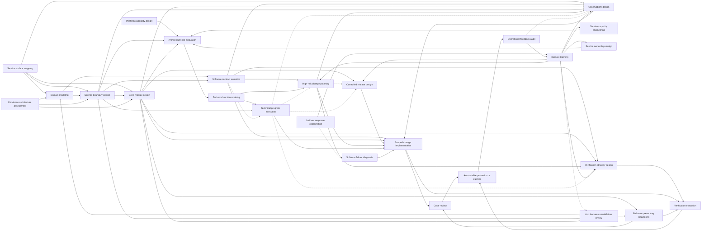

# Software Engineering Skills for Codex

This repository contains 26 reusable Codex skills for consequential software-engineering work. Each skill owns one kind of reasoning artifact or action: an orientation map, model, design, assessment, decision, contract-evolution policy, multi-team execution system, transition or release plan, scoped implementation, diagnosis, refactoring, change review, verification strategy or execution, live incident coordination, operational audit, learning record, or coaching loop.

The collection is designed for production systems and multi-team organizations. The skills require evidence, expose uncertainty, preserve accountable decision rights, and distinguish designing an artifact from independently evaluating whether it works.

## Choose by the artifact you need

Do not start from a fashionable method or invoke every skill as a stage gate. Ask what decision or artifact is currently missing.

### Understand and design

| Skill | It owns | Primary output |
| --- | --- | --- |
| [`service-surface-mapping`](service-surface-mapping/) | Rapid evidence-ranked orientation to an unfamiliar service | Critical-surface map, path traces, contradictions, confidence, and next probes |
| [`domain-modeling`](domain-modeling/) | Problem-specific behavior, invariants, vocabulary, and semantic contexts | Operational principles, compared models, semantic boundaries, translations, and unresolved questions |
| [`service-boundary-design`](service-boundary-design/) | Logical, deployment, data, failure, and ownership boundaries | Boundary force matrix, scenario traces, options, recommendation, and prerequisites |
| [`deep-module-design`](deep-module-design/) | Knowledge boundaries, interfaces, seams, state ownership, and testable contracts | Compared boundaries, deep or composable interface strategy, honest contract, tests, and adoption direction |
| [`platform-capability-design`](platform-capability-design/) | Self-service internal capabilities, paved roads, controls, and escape hatches | User-work evidence, capability boundary, interface, operating contract, and adoption slice |
| [`observability-design`](observability-design/) | Prospective business, service, dependency, infrastructure, and control evidence | Execution-path map, measurement contracts, navigation, alerts, correlation, and lifecycle |

### Assess, engineer, and decide

| Skill | It owns | Primary output |
| --- | --- | --- |
| [`codebase-architecture-assessment`](codebase-architecture-assessment/) | Portfolio-level diagnosis of an existing codebase | Ranked evidence-backed architecture improvement portfolio |
| [`architecture-risk-evaluation`](architecture-risk-evaluation/) | Scenario-based evaluation of architecture assumptions and quality tradeoffs | Risks, non-risks, sensitivities, tradeoffs, unknowns, and evidence needs |
| [`service-capacity-engineering`](service-capacity-engineering/) | End-to-end demand, capacity, headroom, overload, and recovery behavior | Capacity model, operating envelope, falsification evidence, and overload controls |
| [`service-ownership-design`](service-ownership-design/) | Sustainable lifecycle ownership and its enabling conditions | Ownership trace, cognitive-load assessment, model options, prerequisites, and transition |
| [`technical-decision-making`](technical-decision-making/) | Authority, participation, option comparison, closure, and commitment | Decision frame, authority map, decision or escalation, execution, and revisit conditions |

### Plan, coordinate, and control change

| Skill | It owns | Primary output |
| --- | --- | --- |
| [`technical-program-execution`](technical-program-execution/) | Multi-team outcomes, vertical slices, dependencies, integration, flow, and replanning | Outcome contract, delivery topology, active slices, constraints, decision state, and evidence trend |
| [`software-contract-evolution`](software-contract-evolution/) | Shared contract semantics, compatibility, translation, deprecation, consumer adoption, and retirement policy | Actual-contract frame, compatibility matrix, evolution choice, adoption obligations, and retirement evidence |
| [`controlled-release-design`](controlled-release-design/) | Feature flags, exposure assignment, cohorts, release phases, and kill controls | Release contract, control topology, evidence, phase criteria, retreat, and cleanup |
| [`high-risk-change-planning`](high-risk-change-planning/) | Transition states for risky API, schema, data, service, and infrastructure changes | Phased coexistence plan with invariants, evidence, abort, retreat, and cleanup |
| [`verification-strategy-design`](verification-strategy-design/) | Matching engineering claims and risks to falsifying evidence | Risk-to-evidence portfolio with methods, oracles, limits, and renewal triggers |

### Implement, diagnose, and verify

| Skill | It owns | Primary output |
| --- | --- | --- |
| [`scoped-change-implementation`](scoped-change-implementation/) | Authorized bounded behavior change through coherent vertical slices | Maintained code, behavior evidence, completed ownership, deviations, and remaining gaps |
| [`behavior-preserving-refactoring`](behavior-preserving-refactoring/) | Structural improvement without intentional supported-behavior change | Consolidated ownership, refactoring-safe evidence, retired old paths, and equivalence limits |
| [`software-failure-diagnosis`](software-failure-diagnosis/) | Causal investigation of bugs, regressions, intermittent failures, and performance degradation | Symptom contract, evidence loop, competing hypotheses, supported cause, and repair boundary |
| [`code-review`](code-review/) | Independent read-only review of a bounded software change | Prioritized evidence-backed findings, questions, scope limits, and residual risks |
| [`verification-execution`](verification-execution/) | Execution of fixed verification claims, methods, and oracles | Per-claim results, raw evidence, counterexamples, cleanup, and unresolved gaps |

### Operate, learn, and renew

| Skill | It owns | Primary output |
| --- | --- | --- |
| [`incident-response-coordination`](incident-response-coordination/) | Live stabilization, accountable command, delegated workstreams, and response communication | Operational picture, impact trend, command decisions, workstreams, recovery criteria, and handoff |
| [`operational-feedback-audit`](operational-feedback-audit/) | The live telemetry-to-decision-to-action loop | Contract counterexamples and deltas, alert and diagnostic findings, routing and control-path risks |
| [`incident-learning`](incident-learning/) | Learning from incidents, near misses, and operational surprises | Evidence timeline, local perspectives, model gaps, protective capacity, and branching follow-through |
| [`architecture-consolidation-review`](architecture-consolidation-review/) | Reviewing whether accumulated implementation and operational learning warrants architectural consolidation | Knowledge delta, pressure diagnosis, durable commitments, candidate comparison, and retain/quarantine/prune/reshape/rebuild route |

### Develop technical capability

| Skill | It owns | Primary output |
| --- | --- | --- |
| [`technical-growth-coaching`](technical-growth-coaching/) | Deliberate practice, calibrated delegation, feedback, and transfer | Capability baseline, practice assignment, delegation contract, and transfer test |

## The relationship model

The skills form a directed graph. A downstream skill consumes an upstream artifact only when the decision warrants it.



This is not a mandatory lifecycle. For example, a local reversible feature may need only `scoped-change-implementation` and repository checks. A structure-only cleanup may use `behavior-preserving-refactoring` without architecture review. A multi-team feature may use `technical-program-execution` to coordinate slices and integration while composing observability, controlled release, change review, and verification without a heavyweight architecture evaluation. A multi-region ledger migration may require architecture evaluation, a decision record, technical program execution, high-risk change planning, controlled exposure, layered verification, and an operational feedback audit. An active outage may need incident-response coordination and diagnosis before it can move into recovery and incident learning.

## Design and evaluation are different jobs

A skill that creates an artifact should not silently certify that artifact. For consequential work, use a separate evaluation pass with explicit claims, independent evidence, and permission to reject or revise the design.

| Produced artifact | Appropriate evaluator or challenge |
| --- | --- |
| Service surface map | Source-owner review and focused follow-up; orientation does not certify readiness or safety |
| Domain, service-boundary, module, or platform design | `architecture-risk-evaluation` for consequential quality and operating scenarios |
| Codebase improvement proposal | Local evidence review, followed by the relevant focused design skill |
| Architecture option comparison | `technical-decision-making` for accountable weighting and closure |
| Technical program execution state | Accountable outcome owner and integrated delivery evidence; activity and coordinator confidence do not certify the outcome |
| Software contract evolution design | Producer, consumer, data, and support-policy owners review the recovered contract and compatibility claims; use `verification-strategy-design` and independent architecture challenge as consequence warrants |
| Observability design | Instrumentation and signal verification, then `operational-feedback-audit` against representative runtime use |
| Controlled release design | `verification-strategy-design` for claims and phase evidence; accountable owners retain promotion authority |
| High-risk transition plan | `verification-strategy-design` for falsifiable phase and invariant evidence |
| Running telemetry and response system | `operational-feedback-audit` against observed decisions and incidents |
| Scoped implementation | `code-review` for an independent diff challenge and `verification-execution` for fixed consequential claims |
| Behavior-preserving refactoring | `code-review`, plus `verification-execution` when equivalence crosses consumer, data, concurrency, performance, failure, or operating boundaries |
| Failure diagnosis | Reproducible or durable causal evidence reviewed by the relevant owner; any repair becomes a separately authorized implementation |
| Live incident response and recovery claim | Accountable incident commander, observed customer and system stability, and a deliberate recovery handoff; use `incident-learning` only after restoration |
| Completed implementation | Executed repository evidence, `code-review`, and independent `verification-execution` when warranted; `architecture-consolidation-review` only when accumulated learning creates a material reason to reconsider the design |

Separation does not require bureaucracy or different people for every local change. It requires a distinct contract: the evaluator receives the artifact and evidence, can identify missing claims, and is not required to defend the producer's original choices. Increase independence with consequence, irreversibility, and uncertainty.

### Keep cross-skill references readable

When skills compose in one task, keep the decision context in flow instead of creating a handoff file. Use a stable namespaced key together with its plain-language label, for example `OBS-settlement-age — Settlement completion age`. Repeat both whenever the contract is cited. The prefix identifies the contract family; the label preserves human meaning.

## Important distinctions

### Orientation versus assessment

Use `service-surface-mapping` to become safely useful in an unfamiliar service: trace critical workflows, reconcile declared and observed dependencies, locate controls and owners, and rank the next probes. It does not score readiness or prescribe a portfolio.

Use `codebase-architecture-assessment` to diagnose and rank structural improvement opportunities across a codebase. Use `architecture-risk-evaluation` to challenge a consequential proposal against stakeholder and quality scenarios.

### Domain, service, and module boundaries

- `domain-modeling` owns meaning, behavior, invariants, vocabulary, and bounded contexts.
- `service-boundary-design` owns deployment, data authority, failure, change cadence, and operating ownership. A bounded context is not automatically a service.
- `deep-module-design` owns interfaces, seams, state, and hidden complexity inside a codebase or service. A module is not automatically a deployable unit.

For a new capability, the common direction is:

```text
domain-modeling
  -> service-boundary-design
  -> deep-module-design
```

For existing service sprawl, boundary evidence may expose semantic confusion and route back through domain modeling before the boundary is reconsidered.

### Codebase assessment versus focused design

Use `codebase-architecture-assessment` to discover and rank structural problems across an existing codebase. Use `deep-module-design` after one module, interface, seam, or vertical slice has been selected for design.

### Design, implementation, and refactoring

- `deep-module-design` decides where knowledge, state, resources, and interface semantics should live. It does not modify the target.
- `scoped-change-implementation` changes supported behavior or adds an authorized capability through coherent vertical slices. TDD is one optional inner feedback loop, not the skill's whole contract.
- `behavior-preserving-refactoring` changes structure while keeping supported behavior stable. Any intentional behavior or support-policy change becomes a separate scoped implementation decision.

A short diff is not automatically surgical. Surgical implementation minimizes unnecessary coupling, dual authority, and unrelated change while completing the ownership and cleanup required by the requested behavior.

### Failure diagnosis versus repair

Use `software-failure-diagnosis` while the cause of a bug, regression, intermittent failure, or performance degradation remains uncertain. It owns symptom preservation, evidence loops, competing hypotheses, causal explanation, and the smallest faithful reproduction or observation recipe. It defaults to read-only diagnosis.

After the cause is supported, use `scoped-change-implementation` only when repair is authorized. Preserve the diagnosis as the reason and regression signal; do not let a plausible patch retroactively become proof of cause.

### Incident response coordination versus diagnosis and learning

Use `incident-response-coordination` during an active outage or severe degradation to establish accountable command, reduce customer harm, organize delegated workstreams, protect communication bandwidth, and reach a deliberate recovery handoff. It owns response coherence, not the technical cause.

Use `software-failure-diagnosis` for the causal technical investigation, whether or not an incident is active. Use `incident-learning` only after restoration to reconstruct local perspectives, system conditions, protective capacity, and durable follow-through. The response coordinator preserves evidence for that later review but does not conduct the postmortem while responders are still stabilizing the system.

Use `operational-feedback-audit` outside the urgent command loop to evaluate whether telemetry, routing, diagnosis, and control paths produced effective operational action. The live coordinator consumes those mechanisms under pressure; it does not independently audit and certify them during the response.

The agent supports a human incident commander by default. It may maintain the operational picture, draft updates, detect conflicts, and coordinate within explicit delegation; consequential production actions, customer commitments, risk acceptance, and incident closure require accountable authorization or a pre-approved bounded runbook.

### Change review versus verification execution

Use `code-review` to inspect a bounded diff against intent, repository constraints, behavior, contracts, maintainability, and claimed evidence. It produces prioritized findings and does not change the target.

Use `verification-execution` to run already-defined `VER-*` claims against fixed methods and oracles. It preserves raw evidence, environment context, counterexamples, inconclusive results, and cleanup. Review can identify an evidence gap; execution can show a claim failed; neither silently approves release.

### Contract evolution versus transition and program execution

Use `software-contract-evolution` to recover what producers and consumers actually rely on and decide how shared semantics, compatibility, translation, deprecation, adoption, and retirement should work. It owns the producer-consumer-state-executor compatibility matrix and the support-policy obligations, not merely an API version number.

Use `high-risk-change-planning` when that decision must become a survivable production transition with explicit phases, authority, cutover, recovery, and cleanup. Use `technical-program-execution` when adoption spans teams and needs dependency-aware slices, integration, decision flow, and replanning. Contract evolution defines what must remain true; the transition plan defines how the system moves; program execution keeps the participating workstreams delivering the end-to-end outcome.

`service-boundary-design` remains responsible for where semantic, data, deployment, failure, and ownership boundaries belong. A contract may evolve at a stable boundary, or a boundary decision may create contracts that then need an evolution policy.

### Architecture risk versus high-risk change

Use `architecture-risk-evaluation` to ask whether the proposed target architecture can satisfy important scenarios and quality drivers. Use `high-risk-change-planning` after a target direction exists to design survivable old, transitional, and new states.

```text
architecture-risk-evaluation
  -> technical-decision-making
  -> high-risk-change-planning
  -> co-design verification, observability, and optional controlled release
  -> scoped-change-implementation
  -> code-review and verification-execution
  -> accountable cutover
```

### Technical decision, program execution, and high-risk change

Use `technical-decision-making` to close a consequential or contested choice with explicit authority and accepted tradeoffs. Use `technical-program-execution` when an outcome spans several teams, services, workstreams, integration points, or decision cadences and needs active dependency-aware steering. Use `high-risk-change-planning` to design one survivable old, transitional, and new state for a consequential migration or production change.

A technical program may contain several ordinary delivery slices and several specialized change plans. It references those plans and exposes their dependencies without taking over their invariants, release controls, measurement contracts, or verification oracles. A single-team feature or one local reversible change does not need program machinery merely because it has several tasks.

```text
technical-decision-making, when closure is needed
  -> technical-program-execution, when delivery spans teams or workstreams
       -> high-risk-change-planning for each consequential transition
       -> coordinated observability, release, verification, implementation, and integration
  -> accountable outcome and residual-risk decision
```

### Controlled release versus high-risk change

Use `controlled-release-design` to define exposure assignment, feature-flag semantics, cohorts, promotion, hold, abort, kill controls, and flag cleanup. Use `high-risk-change-planning` when the larger problem is a staged migration with data authority, coexistence, irreversible effects, consumer coordination, cutover, and recovery. When both apply, controlled release is an optional nested subplan of the authoritative transition plan; many ordinary feature releases need controlled exposure without the full migration workflow, and some migrations need no exposure subplan.

### Observability design versus operational feedback audit

Use `observability-design` before implementation or release to define normative measurement contracts, correlation, health entry points, diagnostic navigation, alerts, and control evidence. Use `operational-feedback-audit` after representative operation to recover those contracts, compare intended and deployed semantics, and report runtime counterexamples and required design deltas. A missing contract is an audit finding, not permission for the auditor to create and certify its own replacement.

```text
observability-design
  -> scoped-change-implementation, with controlled release when applicable
  -> verification-execution for claims that consume runtime evidence
  -> operational-feedback-audit
  -> revise observability design
```

The designer and auditor may be the same person for low-risk work, but the audit must use distinct runtime evidence and retain permission to reject the original assumptions.

### Observability, verification, and operational feedback

- `observability-design` owns the runtime evidence substrate: signal semantics, correlation, navigation, alerts, and control visibility.
- `verification-strategy-design` owns the broader claim-to-evidence portfolio. It may select tests, static checks, formal methods, simulation, load tests, failure injection, rollout evidence, and production telemetry according to risk.
- `verification-execution` runs that portfolio against fixed oracles and preserves per-claim results, counterexamples, environment context, safety stops, and inconclusive evidence.
- `operational-feedback-audit` evaluates whether the running telemetry, ownership routing, diagnosis, and control paths actually produced correct operational action.

Observability can supply evidence to verification, but telemetry is not a substitute for earlier checks. An operational audit can reject both a weak observability design and the assumption that a green signal proved the system healthy.

### Capacity, ownership, and platform capability

- `platform-capability-design` creates a self-service capability and its operating contract.
- `service-capacity-engineering` tests whether useful work completes within an explicit demand and overload envelope.
- `service-ownership-design` tests whether responsibility moves with authority, capability, feedback, staffing, and specialist support.

These are complementary lenses, not one universal platform workflow.

## Common compositions

### New or changing business capability

```text
domain-modeling
  -> service-boundary-design, when deployment/data/ownership is in question
  -> software-contract-evolution, when a shared API, event, schema, protocol, or library contract changes
  -> deep-module-design
  -> architecture-risk-evaluation, when consequences justify it
  -> technical-decision-making
  -> technical-program-execution, when delivery spans teams or workstreams
  -> high-risk-change-planning, when transition risk justifies it
  -> co-design observability, verification, and controlled release when they apply
  -> scoped-change-implementation in coherent vertical slices
  -> code-review
  -> verification-execution for the required claim set
  -> accountable promotion, abort, or risk decision
  -> operational-feedback-audit after release
```

### Feature spanning multiple services

```text
domain-modeling
  -> service-boundary-design
  -> software-contract-evolution for changed APIs, events, schemas, protocols,
     translations, consumer adoption, and retirement obligations
  -> technical-program-execution for the outcome, delivery topology,
     vertical slices, dependencies, integration, and decision cadence
  -> deep-module-design in each affected codebase
  -> co-design:
       observability-design for end-to-end and component evidence
       controlled-release-design for authoritative assignment and mixed states
       verification-strategy-design for claims, methods, and oracles
  -> scoped-change-implementation in each affected codebase
  -> code-review for each bounded change and the composed workflow
  -> verification-execution for local and end-to-end claims
  -> accountable promotion or abort
  -> operational-feedback-audit after representative use
```

Do not let each service independently decide feature exposure when the workflow requires a consistent cohort. Assign once, propagate context, observe end-to-end outcomes, and retain local kill controls only where they govern distinct hazardous effects.

### Shared API, event, or schema evolution

```text
domain-modeling, when meaning or context differs across participants
  -> software-contract-evolution for the actual contract, compatibility matrix,
     translation, deprecation, consumer adoption, and retirement evidence
  -> technical-program-execution, when migration spans teams or consumer groups
  -> high-risk-change-planning, when coexistence, state, irreversible effects,
     cutover, or recovery make the transition consequential
  -> observability-design and verification-strategy-design for named evidence
  -> scoped-change-implementation, code-review, and verification-execution
  -> accountable support, promotion, and retirement decisions
```

Do not remove the old contract because a deadline elapsed or current telemetry is quiet. Match exit evidence to the obligation being retired: consumer drainage, behavioral comparison, state reconciliation, or fencing of stale executors.

### Inheriting a brownfield service

```text
service-surface-mapping
  -> domain-modeling, service-boundary-design, or deep-module-design for the discovered problem
  -> verification-strategy-design for characterization and change claims
  -> software-failure-diagnosis when an observed failure is still unexplained
  -> behavior-preserving-refactoring for an authorized structure-only repair
  -> observability-design when prospective evidence is missing
  -> operational-feedback-audit when the live response loop needs evaluation
  -> controlled-release-design before the first consequential feature rollout
```

Orientation should stop once the immediate decision can move into focused work. It need not document the entire service.

### Existing codebase with recurring friction

```text
codebase-architecture-assessment
  -> service-surface-mapping, when one unfamiliar service needs runtime and ownership orientation
  -> domain-modeling, for semantic confusion
  -> service-boundary-design, for deployment/data/ownership coupling
  -> deep-module-design, for local structure and interfaces
  -> behavior-preserving-refactoring for authorized structural execution
  -> high-risk-change-planning, only for consequential transition work
```

### Contested technical choice

```text
architecture-risk-evaluation, when assumptions need technical analysis
  -> technical-decision-making
  -> technical-program-execution, when execution spans teams or workstreams
  -> high-risk-change-planning
  -> co-design verification, observability, and optional controlled release
  -> scoped-change-implementation
  -> code-review and verification-execution
```

### Active production incident

```text
incident-response-coordination
  -> stabilize customer impact and establish delegated workstreams
  -> software-failure-diagnosis for uncertain technical cause
  -> scoped-change-implementation for an authorized repair
  -> code-review and verification-execution as urgency and consequence allow
  -> controlled recovery, stability evidence, and accountable closure
  -> incident-learning after restoration
```

The incident commander owns response priorities, risk decisions, and closure. The coordinator keeps mitigation, diagnosis, communications, and recovery coherent; it does not replace technical workstream owners or perform the later learning review during active response.

### Bug, regression, or performance failure

```text
software-failure-diagnosis
  -> scoped-change-implementation, only when repair is authorized
  -> code-review
  -> verification-execution when the repair has broader claims
  -> incident-learning when the failure carries operational or organizational learning
```

### Behavior-preserving structural change

```text
deep-module-design for a current design question, or architecture-consolidation-review when accumulated learning leaves the target undecided
  -> behavior-preserving-refactoring
  -> code-review
  -> verification-execution when equivalence is consequential
  -> accountable decision on any intentional behavior retirement
```

### Platform and service operating model

```text
platform-capability-design
  -> service-capacity-engineering
  -> service-ownership-design
  -> architecture-risk-evaluation
  -> technical-decision-making
```

### Incident-driven renewal

```text
incident-response-coordination, during an active incident
  -> incident-learning after restoration
  -> operational-feedback-audit for detection, diagnosis, paging, or routing gaps
  -> observability-design for signal-contract gaps
  -> verification-strategy-design for escaped behavior or evidence gaps
  -> software-failure-diagnosis for an unresolved technical cause
  -> verification-execution for a defined regression or resilience claim
  -> domain-modeling, codebase-architecture-assessment, deep-module-design,
     or service-boundary-design for focused model or structure gaps
  -> service-capacity-engineering for overload and recovery gaps
  -> controlled-release-design or high-risk-change-planning for rollout gaps
  -> service-ownership-design or technical-decision-making for authority gaps
  -> update a runbook, automation, or local process directly when sufficient
  -> architecture-consolidation-review only when accumulated learning creates a material foundational design question
```

One incident may produce several independent branches. Do not force every finding through architecture consolidation or through one serial workflow.

### Architecture consolidation review by scale

```text
module or capability
  -> deep-module-design as the primary lens
  -> behavior-preserving-refactoring for an authorized structure-only route

service or subsystem
  -> service-boundary-design when deployment, data, failure, or ownership is involved
  -> architecture-risk-evaluation for consequential quality claims
  -> scoped-change-implementation or behavior-preserving-refactoring after the target is accepted

multi-service system or wider estate
  -> architecture-risk-evaluation
  -> technical-decision-making for accountable closure when needed
  -> high-risk-change-planning, scoped implementation, change review,
     and independent verification execution before consequential cutover
```

The consolidation reviewer works read-only and activates only when implementation, repeated change, operation, support, or ownership has produced a material knowledge delta. It does not provide a generic second attempt for a weak first design pass. It compares the current or minimally consolidated design as a competent baseline, may recommend retain or quarantine when change would outrun evidence, and names the focused follow-up skills needed for deeper design, scoped implementation, behavior-preserving refactoring, controlled release, or verification. The accountable human confirms support-policy changes, route selection, cutover, and residual-risk acceptance. Builder-run checks may support the decision but do not become an independent equivalence verdict merely because the same agent reports them.

These are routing examples, not mandatory stage gates.

## Example prompts

```text
Use $service-surface-mapping to orient me to this inherited payments service
before I change refund behavior. Time-box the investigation, trace the refund
and recovery paths, distinguish observed from declared evidence, and identify
the next focused review. Do not change anything.
```

```text
Use $observability-design to design business, service, dependency,
infrastructure, and control signals for this feature across the API, queue,
worker, and ledger service. Include correlation, mixed-release states, alert
routing, privacy, rollout evidence, and telemetry retirement.
```

```text
Use $controlled-release-design to define one authoritative feature assignment
for this multi-service workflow. Include flag states, cohort selection,
compatibility, irreversible effects, business and technical guardrails, phase
promotion, abort, compensation, and cleanup.
```

```text
Use $service-boundary-design to assess whether Billing and Collections should
remain separate services. Use domain scenarios, change history, data authority,
runtime dependencies, incidents, and on-call ownership. Recommend only.
```

```text
Use $technical-program-execution to steer this checkout modernization across
the web, identity, payments, ledger, data, and support teams. Define the
outcome and evidence, shape vertical increments, map hard dependencies and
integration points, expose decision latency and the current constraint, and
keep replanning in the existing issue tracker without inventing status theater.
```

```text
Use $architecture-risk-evaluation to challenge this proposed multi-region
ledger architecture against correctness, availability, recovery, latency,
operability, and cost scenarios. Identify evidence needed before a decision.
```

```text
Use $high-risk-change-planning to plan this PostgreSQL-to-Spanner migration.
Include coexistence, write authority, delayed consumers, correctness oracles,
abort criteria, recovery, communications, and cleanup.
```

```text
Use $software-contract-evolution to evolve this payments event without forcing
a coordinated consumer release. Recover declared and observed reliance, compare
compatible options, define semantic translation, prevent new v1 adoption, plan
consumer migration support, and require risk-specific evidence before retiring v1.
```

```text
Use $scoped-change-implementation to add refund approval through one coherent
vertical slice. Preserve unrelated work and current compatibility, use TDD at
the stable behavior seam when useful, implement the smallest coherent change,
run focused then affected checks, and report any design assumption that fails.
```

```text
Use $software-failure-diagnosis to investigate this intermittent duplicate
charge without changing behavior. Preserve the symptom and environment,
construct the tightest faithful evidence loop, compare causal hypotheses, and
report the supported mechanism, counterevidence, confidence, and repair seam.
```

```text
Use $incident-response-coordination to support the accountable incident
commander for this multi-service checkout outage. Establish the impact trend,
stabilization objective, delegated workstreams, decision and action record,
communication cadence, responder handoffs, recovery criteria, and the agent's
authority boundary. Do not self-appoint as commander or declare resolution.
```

```text
Use $behavior-preserving-refactoring to move settlement rules behind one
module owner without changing supported behavior. Establish characterization
evidence, refactor green to green, migrate confidence toward stable seams,
remove the old authority, and state the limits of equivalence demonstrated.
```

```text
Use $code-review to review this branch against the feature intent,
repository constraints, consumer contracts, failure semantics, maintainability,
and claimed evidence. Work read-only and report only prioritized actionable
findings with tight locations and residual risks.
```

```text
Use $verification-execution to run the named VER claims for this migration.
Freeze methods and oracles before execution, preserve exact invocations and raw
evidence, classify pass/fail/inconclusive/not-run per claim, stop on safety
thresholds, and leave cutover authority with the accountable owner.
```

Good prompts name the decision, scope, constraints, evidence, desired artifact, and whether implementation is authorized. The skills should identify missing evidence rather than filling gaps with invented facts.

## Install and invoke

For a repository-scoped installation, place selected skill folders under `<repo>/.agents/skills`. For a user-scoped installation, place them under `$HOME/.agents/skills`. Codex also supports symlinked skill folders.

```powershell
New-Item -ItemType Directory -Force -Path '.agents\skills' | Out-Null
Copy-Item -LiteralPath 'D:\GitHub\zhuochun-skills\service-boundary-design' `
  -Destination '.agents\skills\service-boundary-design' -Recurse
```

Or link a skill so repository edits remain live:

```powershell
New-Item -ItemType Directory -Force -Path "$HOME\.agents\skills" | Out-Null
New-Item -ItemType SymbolicLink `
  -Path "$HOME\.agents\skills\service-boundary-design" `
  -Target 'D:\GitHub\zhuochun-skills\service-boundary-design'
```

Check that the destination does not already exist before copying or linking. Symlink creation may depend on local Windows policy. Invoke explicitly with `$skill-name`; restart Codex if a newly installed or renamed skill does not appear.

## Applying the collection in a large organization

1. Start read-only on a completed or pending real decision.
2. Bind the skill to local repositories, domain language, ADRs, ownership, telemetry, incidents, policies, and supported environments.
3. Preserve the decision owner, affected owners, operators, evidence owners, and risk acceptor.
4. Increase scenario breadth, independent evaluation, and retained evidence with consequence and irreversibility.
5. Measure improved decisions and avoided failure, not report length.
6. Review a skill after incidents, platform or governance changes, and repeated user workarounds.

## Repository structure and quality

```text
skill-name/
├── SKILL.md
├── agents/
│   └── openai.yaml
└── references/
    └── ...
```

Every skill should have a focused trigger, explicit inputs and outputs, authority boundaries, quality gates, failure modes, valid UI metadata, and a passing `skill-creator` structural validation. Forward-test consequential workflows against at least two realistic artifacts: one ordinary case and one boundary condition where the correct result may be to stop, retain a control, or use a smaller skill.

## Forward evaluations

The [`evals`](evals/) suite compares fresh baseline and skill-assisted runs on
the same pinned repository task. It grades decision fit, repository evidence,
mechanism, tradeoffs, actionability, and economy while keeping case-specific
anchors hidden from the producing agent. The first pilot uses the legacy
[`md-writer`](evals/md-writer/cases.md) Atom package for ordinary and boundary
cases across orientation, architecture assessment, module design, retrospective
redesign, and verification strategy.
