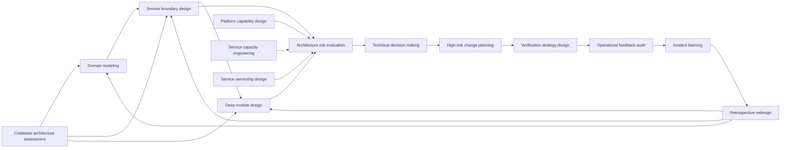

# Software Engineering Skills for Codex

This repository contains 15 reusable Codex skills for consequential software-engineering work. Each skill owns one kind of reasoning artifact: a model, design, assessment, decision, transition plan, verification strategy, operational audit, learning record, or coaching loop.

The collection is designed for production systems and multi-team organizations. The skills require evidence, expose uncertainty, preserve accountable decision rights, and distinguish designing an artifact from independently evaluating whether it works.

## Choose by the artifact you need

Do not start from a fashionable method or invoke every skill as a stage gate. Ask what decision or artifact is currently missing.

### Understand and design

| Skill | It owns | Primary output |
| --- | --- | --- |
| [`domain-modeling`](domain-modeling/) | Business meaning, behavior, invariants, vocabulary, and context boundaries | Scenario-tested model, context boundaries, translations, and unresolved questions |
| [`service-boundary-design`](service-boundary-design/) | Logical, deployment, data, failure, and ownership boundaries | Boundary force matrix, scenario traces, options, recommendation, and prerequisites |
| [`deep-module-design`](deep-module-design/) | Modules, interfaces, seams, state ownership, and testable contracts | Compared interfaces, selected seam, explicit contract, tests, and adoption direction |
| [`platform-capability-design`](platform-capability-design/) | Self-service internal capabilities, paved roads, controls, and escape hatches | User-work evidence, capability boundary, interface, operating contract, and adoption slice |

### Assess, engineer, and decide

| Skill | It owns | Primary output |
| --- | --- | --- |
| [`codebase-architecture-assessment`](codebase-architecture-assessment/) | Portfolio-level diagnosis of an existing codebase | Ranked evidence-backed architecture improvement portfolio |
| [`architecture-risk-evaluation`](architecture-risk-evaluation/) | Scenario-based evaluation of architecture assumptions and quality tradeoffs | Risks, non-risks, sensitivities, tradeoffs, unknowns, and evidence needs |
| [`service-capacity-engineering`](service-capacity-engineering/) | End-to-end demand, capacity, headroom, overload, and recovery behavior | Capacity model, operating envelope, falsification evidence, and overload controls |
| [`service-ownership-design`](service-ownership-design/) | Sustainable lifecycle ownership and its enabling conditions | Ownership trace, cognitive-load assessment, model options, prerequisites, and transition |
| [`technical-decision-making`](technical-decision-making/) | Authority, participation, option comparison, closure, and commitment | Decision frame, authority map, decision or escalation, execution, and revisit conditions |

### Change and verify

| Skill | It owns | Primary output |
| --- | --- | --- |
| [`high-risk-change-planning`](high-risk-change-planning/) | Transition states for risky API, schema, data, service, and infrastructure changes | Phased coexistence plan with invariants, evidence, abort, retreat, and cleanup |
| [`verification-strategy-design`](verification-strategy-design/) | Matching engineering claims and risks to falsifying evidence | Risk-to-evidence portfolio with methods, oracles, limits, and renewal triggers |

### Operate, learn, and renew

| Skill | It owns | Primary output |
| --- | --- | --- |
| [`operational-feedback-audit`](operational-feedback-audit/) | The live telemetry-to-decision-to-action loop | Measurement contracts, alert and diagnostic findings, routing and control-path risks |
| [`incident-learning`](incident-learning/) | Learning from incidents, near misses, and operational surprises | Evidence timeline, local perspectives, model gaps, protective capacity, and follow-through |
| [`retrospective-redesign`](retrospective-redesign/) | First-principles redesign after implementation or operational learning | Learned requirements, simpler target, current comparison, and prune/reshape/rebuild route |

### Develop technical capability

| Skill | It owns | Primary output |
| --- | --- | --- |
| [`technical-growth-coaching`](technical-growth-coaching/) | Deliberate practice, calibrated delegation, feedback, and transfer | Capability baseline, practice assignment, delegation contract, and transfer test |

## The relationship model

The skills form a directed graph. A downstream skill consumes an upstream artifact only when the decision warrants it.



This is not a mandatory lifecycle. For example, a local reversible module change may need only `deep-module-design` and ordinary repository verification. A multi-region ledger migration may require architecture evaluation, a decision record, high-risk change planning, layered verification, and an operational feedback audit.

## Design and evaluation are different jobs

A skill that creates an artifact should not silently certify that artifact. For consequential work, use a separate evaluation pass with explicit claims, independent evidence, and permission to reject or revise the design.

| Produced artifact | Appropriate evaluator or challenge |
| --- | --- |
| Domain, service-boundary, module, or platform design | `architecture-risk-evaluation` for consequential quality and operating scenarios |
| Codebase improvement proposal | Local evidence review, followed by the relevant focused design skill |
| Architecture option comparison | `technical-decision-making` for accountable weighting and closure |
| High-risk transition plan | `verification-strategy-design` for falsifiable phase and invariant evidence |
| Running telemetry and response system | `operational-feedback-audit` against observed decisions and incidents |
| Completed implementation | `retrospective-redesign` using implementation and operation as evidence |

Separation does not require bureaucracy or different people for every local change. It requires a distinct contract: the evaluator receives the artifact and evidence, can identify missing claims, and is not required to defend the producer's original choices. Increase independence with consequence, irreversibility, and uncertainty.

## Important distinctions

### Domain, service, and module boundaries

- `domain-modeling` owns meaning, behavior, invariants, vocabulary, and bounded contexts.
- `service-boundary-design` owns deployment, data authority, failure, change cadence, and operating ownership. A bounded context is not automatically a service.
- `deep-module-design` owns interfaces, seams, state, and hidden complexity inside a codebase or service. A module is not automatically a deployable unit.

For a new capability, the common direction is:

```text
domain-modeling
  -> service-boundary-design
  -> deep-module-design
```

For existing service sprawl, boundary evidence may expose semantic confusion and route back through domain modeling before the boundary is reconsidered.

### Codebase assessment versus focused design

Use `codebase-architecture-assessment` to discover and rank structural problems across an existing codebase. Use `deep-module-design` after one module, interface, seam, or vertical slice has been selected for design.

### Architecture risk versus high-risk change

Use `architecture-risk-evaluation` to ask whether the proposed target architecture can satisfy important scenarios and quality drivers. Use `high-risk-change-planning` after a target direction exists to design survivable old, transitional, and new states.

```text
architecture-risk-evaluation
  -> technical-decision-making
  -> high-risk-change-planning
  -> verification-strategy-design
```

### Verification versus operational feedback

Use `verification-strategy-design` to decide what evidence can falsify engineering claims before and during change. Use `operational-feedback-audit` to evaluate whether the running telemetry, ownership routing, diagnosis, and control paths produce correct operational action.

### Capacity, ownership, and platform capability

- `platform-capability-design` creates a self-service capability and its operating contract.
- `service-capacity-engineering` tests whether useful work completes within an explicit demand and overload envelope.
- `service-ownership-design` tests whether responsibility moves with authority, capability, feedback, staffing, and specialist support.

These are complementary lenses, not one universal platform workflow.

## Common compositions

### New or changing business capability

```text
domain-modeling
  -> service-boundary-design, when deployment/data/ownership is in question
  -> deep-module-design
  -> architecture-risk-evaluation, when consequences justify it
  -> technical-decision-making
  -> high-risk-change-planning, when transition risk justifies it
  -> verification-strategy-design
  -> operational-feedback-audit after release
```

### Existing codebase with recurring friction

```text
codebase-architecture-assessment
  -> domain-modeling, for semantic confusion
  -> service-boundary-design, for deployment/data/ownership coupling
  -> deep-module-design, for local structure and interfaces
  -> high-risk-change-planning, only for consequential transition work
```

### Contested technical choice

```text
architecture-risk-evaluation, when assumptions need technical analysis
  -> technical-decision-making
  -> high-risk-change-planning
  -> verification-strategy-design
```

### Platform and service operating model

```text
platform-capability-design
  -> service-capacity-engineering
  -> service-ownership-design
  -> architecture-risk-evaluation
  -> technical-decision-making
```

### Incident-driven renewal

```text
incident-learning
  -> operational-feedback-audit
  -> domain-modeling, codebase-architecture-assessment, or service-boundary-design
  -> retrospective-redesign, when accumulated learning justifies first-principles reconsideration
```

These are routing examples, not mandatory stage gates.

## Example prompts

```text
Use $service-boundary-design to assess whether Billing and Collections should
remain separate services. Use domain scenarios, change history, data authority,
runtime dependencies, incidents, and on-call ownership. Recommend only.
```

```text
Use $architecture-risk-evaluation to challenge this proposed multi-region
ledger architecture against correctness, availability, recovery, latency,
operability, and cost scenarios. Identify evidence needed before a decision.
```

```text
Use $high-risk-change-planning to plan this PostgreSQL-to-Spanner migration.
Include coexistence, write authority, delayed consumers, correctness oracles,
abort criteria, recovery, communications, and cleanup.
```

Good prompts name the decision, scope, constraints, evidence, desired artifact, and whether implementation is authorized. The skills should identify missing evidence rather than filling gaps with invented facts.

## Install and invoke

For a repository-scoped installation, place selected skill folders under `<repo>/.agents/skills`. For a user-scoped installation, place them under `$HOME/.agents/skills`. Codex also supports symlinked skill folders.

```powershell
New-Item -ItemType Directory -Force -Path '.agents\skills' | Out-Null
Copy-Item -LiteralPath 'D:\GitHub\zhuochun-skills\service-boundary-design' `
  -Destination '.agents\skills\service-boundary-design' -Recurse
```

Or link a skill so repository edits remain live:

```powershell
New-Item -ItemType Directory -Force -Path "$HOME\.agents\skills" | Out-Null
New-Item -ItemType SymbolicLink `
  -Path "$HOME\.agents\skills\service-boundary-design" `
  -Target 'D:\GitHub\zhuochun-skills\service-boundary-design'
```

Check that the destination does not already exist before copying or linking. Symlink creation may depend on local Windows policy. Invoke explicitly with `$skill-name`; restart Codex if a newly installed or renamed skill does not appear.

## Applying the collection in a large organization

1. Start read-only on a completed or pending real decision.
2. Bind the skill to local repositories, domain language, ADRs, ownership, telemetry, incidents, policies, and supported environments.
3. Preserve the decision owner, affected owners, operators, evidence owners, and risk acceptor.
4. Increase scenario breadth, independent evaluation, and retained evidence with consequence and irreversibility.
5. Measure improved decisions and avoided failure, not report length.
6. Review a skill after incidents, platform or governance changes, and repeated user workarounds.

## Repository structure and quality

```text
skill-name/
├── SKILL.md
├── agents/
│   └── openai.yaml
└── references/
    └── ...
```

Every skill should have a focused trigger, explicit inputs and outputs, authority boundaries, quality gates, failure modes, valid UI metadata, and a passing `skill-creator` structural validation. Forward-test consequential workflows against at least two realistic artifacts: one ordinary case and one boundary condition where the correct result may be to stop, retain a control, or use a smaller skill.
