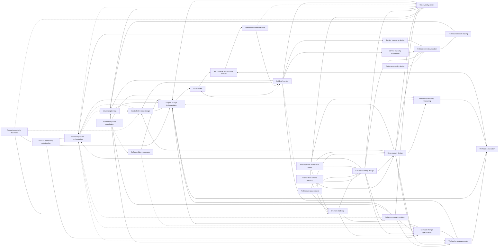

# Skill boundaries and relationships

Use this guide to understand how skills relate, where neighboring ownership
boundaries differ, and why producing and evaluating an artifact remain
separate jobs. For common multi-skill routes, see the
[composition guide](composition-guide.md).

## The relationship model

The skills form a directed graph. A downstream skill consumes an upstream artifact only when the decision warrants it.



`software-change-orchestration` can maintain a bounded change's evolving canonical specification across this graph and preserve a resume point when work spans sessions or artifacts. The immediate frontier normally remains in the active session. Orchestration does not add a required path through the graph or take ownership from any node.

This is not a mandatory lifecycle. For example, an uncertain product request may loop only between opportunity discovery and prioritization until evidence supports stopping or investment. A local reversible feature may need only `scoped-change-implementation` and repository checks. A structure-only cleanup may use `behavior-preserving-refactoring` without architecture review. A multi-workstream feature may use `technical-program-orchestration` to coordinate owned frontiers and integration while composing observability, controlled release, change review, and verification without a heavyweight architecture evaluation. A multi-region ledger migration may require architecture evaluation, a decision record, technical program orchestration, migration planning, controlled exposure, layered verification, and an operational feedback audit. An active outage may need incident-response coordination and diagnosis before it can move into recovery and incident learning.

## Design and evaluation are different jobs

A skill that creates an artifact should not silently certify that artifact. For consequential work, use a separate evaluation pass with explicit claims, independent evidence, and permission to reject or revise the design.

| Produced artifact | Appropriate evaluator or challenge |
| --- | --- |
| Product opportunity discovery result | Accountable product owner and cross-functional decision group challenge the evidence, affected population, alternatives, and limits; prioritization may reject investment readiness without rewriting the discovery result |
| Product opportunity priority recommendation | Accountable product owner or declared forum closes the decision after customer, commercial, technical, operational, and mandatory-risk owners challenge the rationale and feasibility |
| Architecture surface map | Source-owner review and focused follow-up; orientation does not certify architecture fitness, readiness, or safety |
| Domain, service-boundary, module, or platform design | `architecture-risk-evaluation` for consequential quality and operating scenarios |
| Codebase improvement proposal | Local evidence review, followed by the relevant focused design skill |
| Architecture option comparison | `technical-decision-making` for accountable weighting and closure |
| Technical program orchestration state | Accountable outcome owner and integrated delivery evidence; activity and coordinator confidence do not certify the outcome |
| Software contract evolution design | Producer, consumer, data, and support-policy owners review the recovered contract and compatibility claims; use `verification-strategy-design` and independent architecture challenge as consequence warrants |
| Software change specification | Accountable change, product, domain, consumer, security, data, and operational owners challenge the interpretations they own; consequential architecture and evidence claims route to independent evaluation rather than being self-certified by the specifier |
| Observability design | Instrumentation and signal verification, then `operational-feedback-audit` against representative runtime use |
| Controlled release design | `verification-strategy-design` for claims and phase evidence; accountable owners retain promotion authority |
| High-risk transition plan | `verification-strategy-design` for falsifiable phase and invariant evidence |
| Running telemetry and response system | `operational-feedback-audit` against observed decisions and incidents |
| Scoped implementation | `code-review` for an independent diff challenge and `verification-execution` for fixed consequential claims |
| Behavior-preserving refactoring | `code-review`, plus `verification-execution` when equivalence crosses consumer, data, concurrency, performance, failure, or operating boundaries |
| Failure diagnosis | Reproducible or durable causal evidence reviewed by the relevant owner; any repair becomes a separately authorized implementation |
| Live incident response and recovery claim | Accountable incident commander, observed customer and system stability, and a deliberate recovery handoff; use `incident-learning` only after restoration |
| Completed implementation | Executed repository evidence, `code-review`, and independent `verification-execution` when warranted; `retrospective-architecture-review` only when accumulated learning creates a material reason to reconsider the design |

Separation does not require bureaucracy or different people for every local change. It requires a distinct contract: the evaluator receives the artifact and evidence, can identify missing claims, and is not required to defend the producer's original choices. Increase independence with consequence, irreversibility, and uncertainty.

### Keep cross-skill references readable

When skills compose in one task, keep the decision context in flow instead of creating a handoff file. Use a stable namespaced key together with its plain-language label, for example `OBS-settlement-age — Settlement completion age`. Repeat both whenever the contract is cited. The prefix identifies the contract family; the label preserves human meaning.

## Important distinctions

### Product discovery, prioritization, and delivery

- `product-opportunity-discovery` reduces uncertainty about a desired outcome, customer opportunity, assumptions, and alternative solution directions. It may recommend learning, narrowing, pivoting, stopping, prioritization, or investment readiness; it does not allocate the roadmap or promise delivery.
- `product-opportunity-prioritization` allocates bounded product attention and capacity among sufficiently framed opportunities and bets. It keeps mandatory and enabling work visible, preserves different learning horizons, and makes selection, deferral, and review rationale inspectable; it does not discover every opportunity or sequence execution.
- `technical-program-orchestration` coordinates several concurrent or interdependent workstream loops, dependencies, integration, and evidence after an outcome and investment direction have been accepted. Team count alone does not define a program. `scoped-change-implementation` owns a bounded authorized implementation.

Discovery and prioritization form a feedback loop. Prioritization may fund another discovery slice rather than a full solution; discovery evidence may split, merge, weaken, strengthen, or remove an opportunity and reopen priority. `domain-modeling` owns complex software meaning, behavior, and invariants once those become the problem, while `controlled-release-design` and `observability-design` own governed production exposure and deployed measurement contracts.

### Change orchestration, specification, and program orchestration

- `software-change-orchestration` owns continuity and composition economy for one bounded change effort: authorization and escalation boundaries, derived assurance posture and workflow budget, evolving canonical specification or work surface, one primary owner per move, reusable evidence, and durable handoff state when needed. It keeps the immediate frontier in the active session during uninterrupted work and may use an existing specification or issue instead of creating another document.
- `software-change-specification` owns the implementation-ready behavior contract for one accepted but ambiguous change. Within orchestration it consumes the originating request and accepted frame, updates the supplied canonical surface with only its specification delta when authorized, and can classify the change as not ready.
- `technical-program-orchestration` owns the canonical program surface, multi-workstream delivery topology, workstream contracts and drivers, local and program frontiers, integration, constraints, and replanning. It links canonical local artifacts rather than becoming their executor or a duplicate program office.
- `behavior-preserving-refactoring` is the primary executor for a pure structural slice whose supported behavior must remain unchanged. `scoped-change-implementation` is the primary executor for an intended observable behavior change. Do not stack both complete workflows around one pure refactor; split a mixed change or nominate one primary executor and borrow only the needed checks. Review, verification, promotion, and residual-risk acceptance remain separate judgments.

The orchestration unit is a **change effort**, not necessarily a whole product or repository. Related slices may share one effort when they serve one outcome and depend on the same behavior or risk decisions. Small reversible changes stay inline with no orchestration directory. When durable state is justified, use the owning repository if one repo owns the behavior; use an established control repository when no code repository owns the cross-repository outcome. Touching or reading several repositories is not by itself a reason to create control-repository state.

A program is not merely a larger change effort. Program orchestration steers a graph of workstream contributions, dependencies, integration contracts, and simultaneous frontiers. A program may link several bounded change efforts, while one change effort may also require program orchestration when its delivery spans interdependent teams. Use `software-change-orchestration` only for workstreams that need their own resumable software-change loop; keep non-code or already well-governed workstreams in their existing canonical surfaces.

### Orientation versus assessment

Use `architecture-surface-mapping` to become safely useful in unfamiliar software at a declared module, service, subsystem, platform, codebase, or capability scope: trace critical workflows, reconcile declared, executable, and observed structure, locate controls and owners, and rank the next probes. It does not evaluate architecture fitness, score readiness, prescribe a portfolio, or design the target architecture.

Use `architecture-assessment` to diagnose and rank structural improvement opportunities across a declared module, service, subsystem, platform, codebase, capability, or estate scope. Use `architecture-risk-evaluation` to challenge a consequential proposal against stakeholder and quality scenarios.

### Domain, service, and module boundaries

- `domain-modeling` owns meaning, behavior, invariants, vocabulary, and bounded contexts.
- `service-boundary-design` owns deployment, data authority, failure, change cadence, and operating ownership. A bounded context is not automatically a service.
- `deep-module-design` owns interfaces, seams, state, and hidden complexity inside a codebase or service. A module is not automatically a deployable unit.

For a new capability, the common direction is:

```text
domain-modeling
  -> service-boundary-design
  -> deep-module-design
```

For existing service sprawl, boundary evidence may expose semantic confusion and route back through domain modeling before the boundary is reconsidered.

### Architecture assessment versus focused design

Use `architecture-assessment` to discover and rank structural problems across a declared existing architecture scope. Use `deep-module-design` after one module, interface, seam, or vertical slice has been selected for design.

### Portfolio assessment versus retrospective review

- `architecture-assessment` starts before a redesign target is selected. It compares structural pressures across a declared module, service, subsystem, platform, codebase, capability, or estate scope and ranks which opportunities deserve focused investigation or investment.
- `retrospective-architecture-review` starts with one selected completed design and a material knowledge delta from implementation, repeated change, operation, support, or ownership. It recovers durable commitments, compares the current design with alternatives, and recommends retain, quarantine, prune, reshape, or rebuild.

Route by the decision, not by shared evidence. “Where should we invest in architecture?” belongs to portfolio assessment. “Has what we learned changed the right design for this capability?” belongs to retrospective review. Do not run both as serial general assessments; route a selected portfolio candidate to the focused design skill it needs, and use retrospective review only when accumulated learning creates its distinct decision.

### Design, specification, implementation, and refactoring

- `deep-module-design` decides where knowledge, state, resources, and interface semantics should live. It does not modify the target.
- `software-change-specification` turns one accepted but ambiguous change into a reviewable behavioral contract: current and desired behavior, invariants, scope, affected surfaces, representative examples, acceptance claims, unknowns, and readiness. It specifies the change rather than the patch and does not authorize implementation.
- `scoped-change-implementation` consumes that contract when one exists, or resolves a compact inline contract for a local reversible change, then changes supported behavior through coherent vertical slices. TDD is one optional inner feedback loop, not the skill's whole contract.
- `behavior-preserving-refactoring` changes structure while keeping supported behavior stable. Any intentional behavior or support-policy change becomes a separate scoped implementation decision.

A specification is an optional escalation, not a universal gate. A short diff is not automatically surgical, but a cheap reversible change should not wait for document completion when its intent and contract are already clear. Surgical implementation minimizes unnecessary coupling, dual authority, and unrelated change while completing the ownership and cleanup required by the requested behavior.

### Failure diagnosis versus repair

Use `software-failure-diagnosis` while the cause of a bug, regression, intermittent failure, or performance degradation remains uncertain. It owns symptom preservation, evidence loops, competing hypotheses, causal explanation, and the smallest faithful reproduction or observation recipe. It defaults to read-only diagnosis.

After the cause is supported, use `scoped-change-implementation` only when repair is authorized. Preserve the diagnosis as the reason and regression signal; do not let a plausible patch retroactively become proof of cause.

### Incident response coordination versus diagnosis and learning

Use `incident-response-coordination` during an active outage or severe degradation to establish accountable command, reduce customer harm, organize delegated workstreams, protect communication bandwidth, and reach a deliberate recovery handoff. It owns response coherence, not the technical cause.

Use `software-failure-diagnosis` for the causal technical investigation, whether or not an incident is active. Use `incident-learning` only after restoration to reconstruct local perspectives, system conditions, protective capacity, and durable follow-through. The response coordinator preserves evidence for that later review but does not conduct the postmortem while responders are still stabilizing the system.

Use `operational-feedback-audit` outside the urgent command loop to evaluate whether telemetry, routing, diagnosis, and control paths produced effective operational action. The live coordinator consumes those mechanisms under pressure; it does not independently audit and certify them during the response.

The agent supports a human incident commander by default. It may maintain the operational picture, draft updates, detect conflicts, and coordinate within explicit delegation; consequential production actions, customer commitments, risk acceptance, and incident closure require accountable authorization or a pre-approved bounded runbook.

### Change review versus verification execution

Use `code-review` to inspect a bounded diff against intent, repository constraints, behavior, contracts, maintainability, and claimed evidence. It produces prioritized findings and does not change the target.

Use `verification-strategy-design` to preserve upstream behavior and invariant claims while defining the missing `VER-*` methods, oracles, limits, and renewal obligations. Use `verification-execution` to validate existing snapshot-bound evidence and run claims that are missing, stale, invalidated, suspicious, explicitly independent, or required as a fresh set. It preserves raw evidence, environment context, counterexamples, inconclusive results, and cleanup. Review can identify an evidence gap; execution can show a claim failed; neither silently approves release.

### Contract evolution versus transition and program orchestration

Use `software-contract-evolution` to recover what producers and consumers actually rely on and decide how shared semantics, compatibility, translation, deprecation, adoption, and retirement should work. It owns the producer-consumer-state-executor compatibility matrix and the support-policy obligations, not merely an API version number.

Use `migration-planning` when that decision must become a survivable production transition with explicit phases, authority, cutover, recovery, and cleanup. Use `technical-program-orchestration` when adoption forms several concurrent or interdependent workstreams and needs owned frontiers, dependency-aware slices, integration, decision flow, and replanning. Contract evolution defines what must remain true; the migration plan defines how the system moves; program orchestration keeps the participating workstreams delivering the end-to-end outcome.

`service-boundary-design` consumes semantic boundaries from `domain-modeling` and decides whether data, deployment, failure, and operating enforcement should move. When in-process modularity is selected, `deep-module-design` owns the hidden knowledge, interface, lifecycle semantics, and adoption details. A contract may evolve at a stable boundary, or a boundary decision may create contracts that then need an evolution policy.

### Architecture risk versus migration planning

Use `architecture-risk-evaluation` to ask whether the proposed target architecture can satisfy important scenarios and quality drivers. Use `migration-planning` after a target direction exists to design survivable old, transitional, and new states.

```text
architecture-risk-evaluation
  -> technical-decision-making
  -> migration-planning
  -> co-design verification, observability, and optional controlled release
  -> scoped-change-implementation
  -> code-review and verification-execution
  -> accountable cutover
```

### Technical decision, program orchestration, and migration planning

Use `technical-decision-making` to close a consequential or contested choice with explicit authority and accepted tradeoffs. Use `technical-program-orchestration` when an outcome has several concurrent or interdependent workstreams whose dependencies, integration points, shared decisions, or constraints need active steering through local and program frontiers. Use `migration-planning` to design one survivable old, transitional, and new state for a consequential migration or production change.

A technical program may contain several ordinary delivery slices and several specialized change plans. It references those plans and exposes their dependencies without taking over their invariants, release controls, measurement contracts, or verification oracles. A single-team feature or one local reversible change does not need program machinery merely because it has several tasks.

```text
technical-decision-making, when closure is needed
  -> technical-program-orchestration, when delivery has several concurrent or interdependent workstreams
       -> migration-planning for each consequential transition
       -> coordinated observability, release, verification, implementation, and integration
  -> accountable outcome and residual-risk decision
```

### Controlled release versus migration planning

Use `controlled-release-design` to define exposure assignment, feature-flag semantics, cohorts, promotion, hold, abort, kill controls, and flag cleanup. Use `migration-planning` when the larger problem is a staged migration with data authority, coexistence, irreversible effects, consumer coordination, cutover, and recovery. When both apply, controlled release is an optional nested subplan of the authoritative migration plan; many ordinary feature releases need controlled exposure without the full migration workflow, and some migrations need no exposure subplan.

### Observability design versus operational feedback audit

Use `observability-design` before implementation or release to define normative measurement contracts, correlation, health entry points, diagnostic navigation, alerts, and control evidence. Use `operational-feedback-audit` after representative operation to recover those contracts, compare intended and deployed semantics, and report runtime counterexamples and required design deltas. A missing contract is an audit finding, not permission for the auditor to create and certify its own replacement.

```text
observability-design
  -> scoped-change-implementation, with controlled release when applicable
  -> verification-execution for claims that consume runtime evidence
  -> operational-feedback-audit
  -> revise observability design
```

The designer and auditor may be the same person for low-risk work, but the audit must use distinct runtime evidence and retain permission to reject the original assumptions.

### Observability, verification, and operational feedback

- `observability-design` owns the runtime evidence substrate: signal semantics, correlation, navigation, alerts, and control visibility.
- `verification-strategy-design` owns the broader claim-to-evidence portfolio. It may select tests, static checks, formal methods, simulation, load tests, failure injection, rollout evidence, and production telemetry according to risk.
- `verification-execution` runs that portfolio against fixed oracles and preserves per-claim results, counterexamples, environment context, safety stops, and inconclusive evidence.
- `operational-feedback-audit` evaluates whether the running telemetry, ownership routing, diagnosis, and control paths actually produced correct operational action.

Observability can supply evidence to verification, but telemetry is not a substitute for earlier checks. An operational audit can reject both a weak observability design and the assumption that a green signal proved the system healthy.

### Capacity, ownership, and platform capability

- `platform-capability-design` creates a self-service capability and its operating contract.
- `service-capacity-engineering` tests whether useful work completes within an explicit demand and overload envelope.
- `service-ownership-design` tests whether responsibility moves with authority, capability, feedback, staffing, and specialist support.

These are complementary lenses, not one universal platform workflow.
